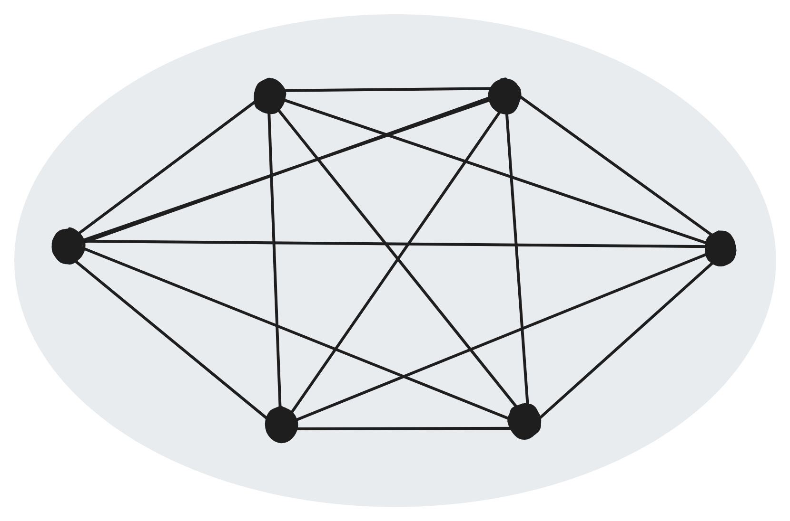

# webConnect.js
📶 Auto WebRTC Mesh P2P Network without signaling server.

[](https://www.npmjs.com/package/webconnect)

Demo : [https://nuzulul.github.io/webConnect.js/demo/](https://nuzulul.github.io/webConnect.js/demo/)



## Why?

I got tired of building and maintenance signaling server for my WebRTC projects

## How it works?

A direct browser to browser connection for static client side web application is normally impossible. Currently, the solution available was using WebRTC transport, which still required to setup a signaling server as a middleman. webConnect.js can create auto WebRTC mesh peer-to-peer connection without any hassle. This library works by leveraging already established public protocol, such as Torrent, MQTT and NOSTR for signaling, eliminating the need for backend servers forever. Now static client side web application can talk to each other, even hosts on static hosting such as github pages, cloudflare pages, gitlab pages, netlify or any other static hosting you name it even on local host.

## Features

* ✅ Auto WebRTC mesh p2p connection.
* ✅ No need setup signaling server.
* ✅ Zero configuration for local network connection.

## Ideas

- P2P Chat
- P2P File Transfer
- P2P Video Call
- P2P Media Streaming
- P2P Game
- P2P Screen Sharing
- P2P Camera

## Example

- [WIFIDrop](https://github.com/nuzulul/wifidrop) - Instant transfer unlimited size of files over WIFI powered by WebRTC.

## Installation

CDN
```javascript
<script src="https://cdn.jsdelivr.net/npm/webconnect@0.0.10/dist/umd/webconnect.js"></script>
```
```javascript
<script type="module">
	import webconnect from 'https://cdn.jsdelivr.net/npm/webconnect@0.0.10/dist/esm/webconnect.js'
</script>
```

Browserify / NPM
```javascript
npm install webconnect

//Common JS 
const webconnect = require('webconnect')

//ES Module
import webconnect from 'webconnect'
```

## Get Started
### Initialization

```javascript
const connect = webconnect({})
```
### Listen
Listen on new connect
```javascript
connect.onConnect((attribute) => console.log(`${attribute.connectId} connected`))
```
Listen on disconnect event
```javascript
connect.onDisconnect((attribute) => console.log(`${attribute.connectId} disconnected`))
```
Listen on receiving data
```javascript
connect.onReceive((data,attribute) => console.log(`${data} from ${attribute.connectId}`))
```
Listen on sending progress
```javascript
connect.onSendProgress((attribute) => console.log(`Sending progress : ${attribute.percent} to ${attribute.connectId}`))
```
Listen on receiving progress
```javascript
connect.onReceiveProgress((attribute) => console.log(`Receiving progress : ${attribute.percent} from ${attribute.connectId}`))
```
Listen on incoming streaming
```javascript
connect.onStreaming((stream,attribute) => Elements[attribute.connectId].video.srcObject = stream )
```
### Action
Get My Connection Id
```javascript
connect.getMyId((attribute) => console.log(`${attribute.connectId}`))
```
Send Data
```javascript
const attribute = {connectId}
connect.Send(data,attribute)
```
Send Binary
```javascript
const attribute = {connectId,metadata:{name: 'Report', type: 'application/pdf'}}
connect.Send(buffer,attribute)
```
Open Streaming
```javascript
const attribute = {connectId,metadata:{name:'Meeting'}}
connect.openStreaming(stream,attribute)
```
Close Streaming
```javascript
const attribute = {connectId}
connect.closeStreaming(stream,attribute)
```
Ping Connection
```javascript
const attribute = {connectId}
console.log(`${await connect.Ping(attribute)} ms`)
```
Disconnect
```javascript
connect.Disconnect()
```
Get All Connection Id
```javascript
connect.getConnection((attribute) => console.log(`${attribute.connection}`))
```
## Example
```javascript
<script type="module">
	import webconnect from 'https://cdn.jsdelivr.net/npm/webconnect@0.0.10/dist/esm/webconnect.js'
	
	const connect = webconnect({})
	connect.onConnect(async(attribute)=>{
		console.log("Connect",attribute)
		connect.Send("hello",{connectId:attribute.connectId})
		console.log(await connect.Ping({connectId:attribute.connectId}))
		connect.getConnection((attribute)=>{
			console.log("Connection",attribute)
		})
	})
	connect.onDisconnect((attribute)=>{
		console.log("Disconnect",attribute)
	})
	
	connect.onReceive((data,attribute) =>{
		console.log(data,attribute)
	})
</script>
```

```javascript
import webconnect from 'webconnect'

void async function main() {

	const connect = webconnect({})
	connect.onConnect(async(attribute)=>{
		console.log("Connect",attribute)
		connect.Send("hello",{connectId:attribute.connectId})
		console.log(await connect.Ping({connectId:attribute.connectId}))
		connect.getConnection((attribute)=>{
			console.log("Connection",attribute)
		})
	})
	connect.onDisconnect((attribute)=>{
		console.log("Disconnect",attribute)
	})
	
	connect.onReceive((data,attribute) =>{
		console.log(data,attribute)
	})
	
}()
```

## API

### Connect to a channel

```javascript
webconnect({appName,channelName,connectPassword,iceConfiguration})
```
options :
- appName - (String) Your app identity
- channelName - (String) Channel to connect
- connectPassword - (String) Password to encrypt connection initialization
- iceConfiguration - (Object) Custom [iceConfiguration](https://webrtc.org/getting-started/turn-server)

### Listen to every new connection

```javascript
onConnect((attribute)=>{})
```
- `attribute = {connectId}` - `connectId` is origin connection identity

### Listen to every disconnection

```javascript
onDisconnect((attribute)=>{})
```
- `attribute = {connectId}` - `connectId` is origin connection identity

### Send data to connection 

```javascript
Send(data,attribute)
```
- `data = String or Object`
- `attribute = {connectId}` - `connectId` is target connection can single `connectId` , multiple with array `[connectId,connectId,...]` or `null` to target all connection in the channel 

### Send binary data to connection

```javascript
Send(ArrayBuffer,attribute)
```
- `ArrayBuffer = Binary data`
- `attribute = {connectId,metadata}` - `connectId` is target connection can single `connectId` , multiple with array `[connectId,connectId,...]` or `null` to target all connection in channel - `metadata` is optional metadata object like filename or filetype

### Listen to sending progress for binary data

```javascript
onSendProgress((attribute) => {})
```
- `attribute = {percent,connectId}` - `percent` indicating the percentage between 0 and 1, `connectId` is target connection

### Listen to receiving data

```javascript
onReceive((data,attribute) => {})
```
- `data = String or Object or ArrayBuffer`
- `attribute = {connectId,metadata}` - `connectId` is origin connection identity - `metadata` is object description about the ArrayBuffer

### Listen to receiving progress for binary data

```javascript
onReceiveProgress((attribute) => {})
```
- `attribute = {percent,connectId}` - `percent` indicating the percentage between 0 and 1, `connectId` is origin connection identity

### Open streaming connection

```javascript
openStreaming(stream,attribute)
```
- `stream = MediaStream` - A `MediaStream` with audio and/or video 
- `attribute = {connectId, metadata}` - `connectId` is target connection - `metadata` is optional object stream description

### Listen to incoming streaming connection

```javascript
onStreaming((stream,attribute) => {})
```
- `stream = MediaStream` - A `MediaStream` with audio and/or video 
- `attribute = {connectId,metadata}` - `connectId` is origin connection identity - `metadata` is optional stream description

### Close streaming connection

```javascript
closeStreaming(stream,attribute)
```
- `stream = MediaStream` - A previously opened MediaStream
- `attribute = {connectId}` - `connectId` is target connection

### Get self connection identity

```javascript
getMyId((attribute) => {})
```
- `attribute = {connectId}` - `connectId` is self connection identity
### Get all connection identity in the channel

```javascript
getConnection((attribute) => {})
```
- `attribute = {connection,connections}` - `connection` is Array of all connection identity exclude self connection identity - `connections` is [RTCPeerConnection](https://nuzulul.github.io/webConnect.js/demo/) object

### Get latency of connection which return a promise that resolve to milliseconds

```javascript
Ping(attribute)
```
- `attribute = {connectId}` - `connectId` is target connection

### Disconnect from channel

```javascript
Disconnect()
```

## Related

- [WebPEER](https://github.com/nuzulul/webpeerjs) - WebPEER is a P2P Network that Runs in a Browser.
- [RingsNetwork](https://github.com/RingsNetwork/rings) - Rings is a structured peer-to-peer network implementation using WebRTC, Chord DHT, and full WebAssembly (WASM) support.

## License

[MIT](https://github.com/nuzulul/webConnect.js/blob/main/LICENSE)

## Maintainers

[Nuzulul Zulkarnain](https://github.com/nuzulul)